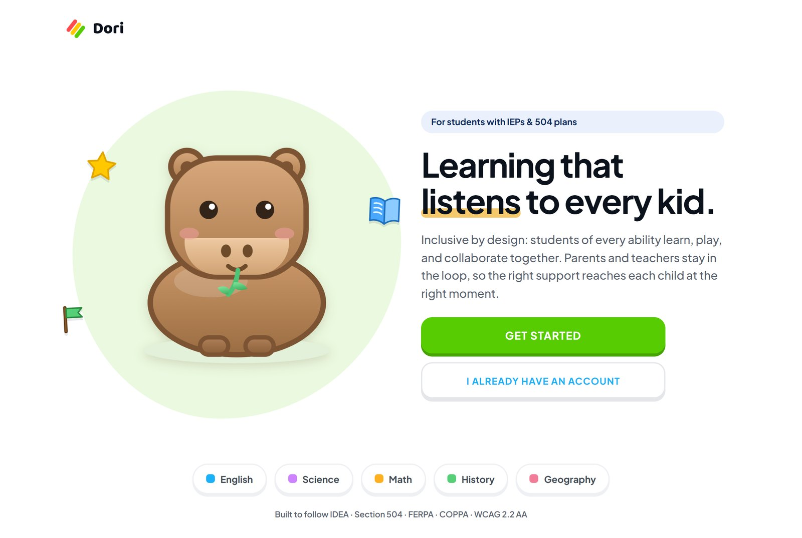
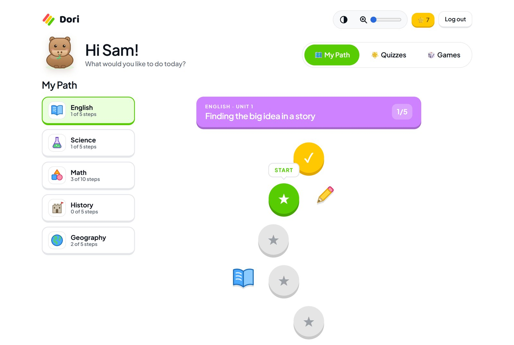
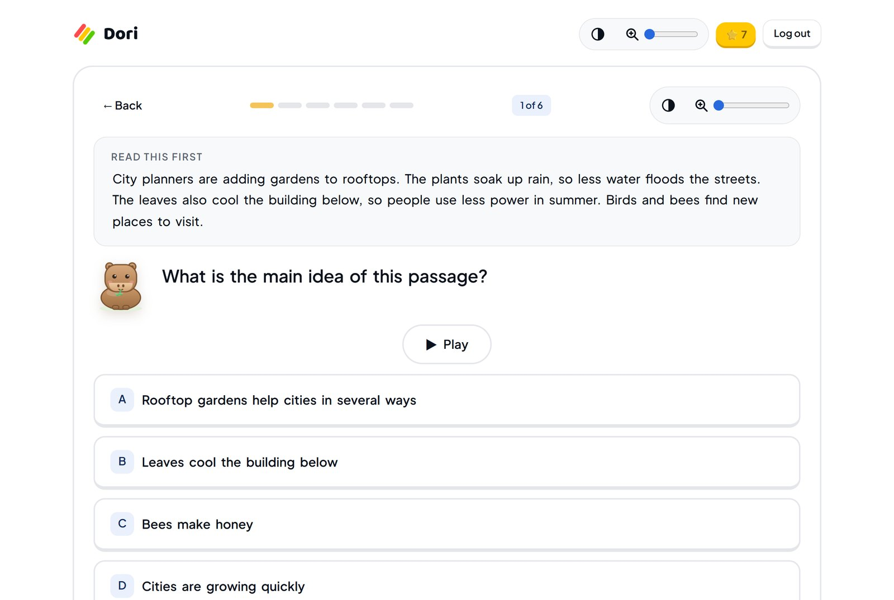
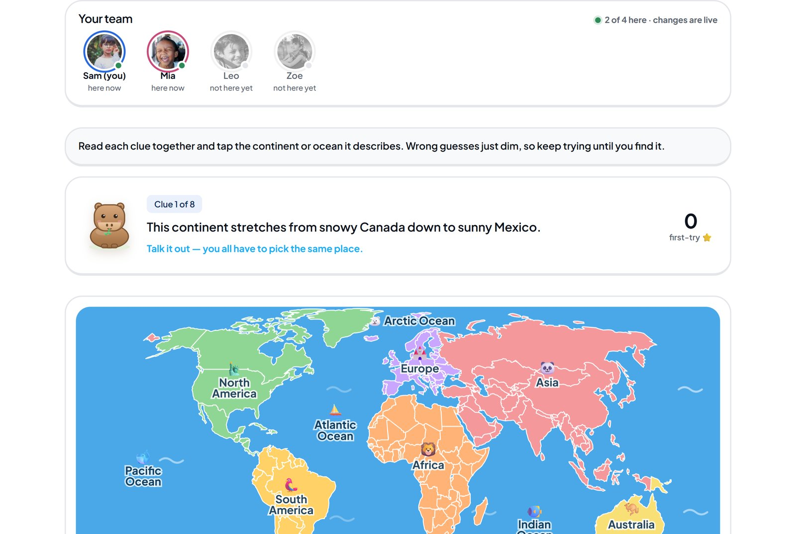
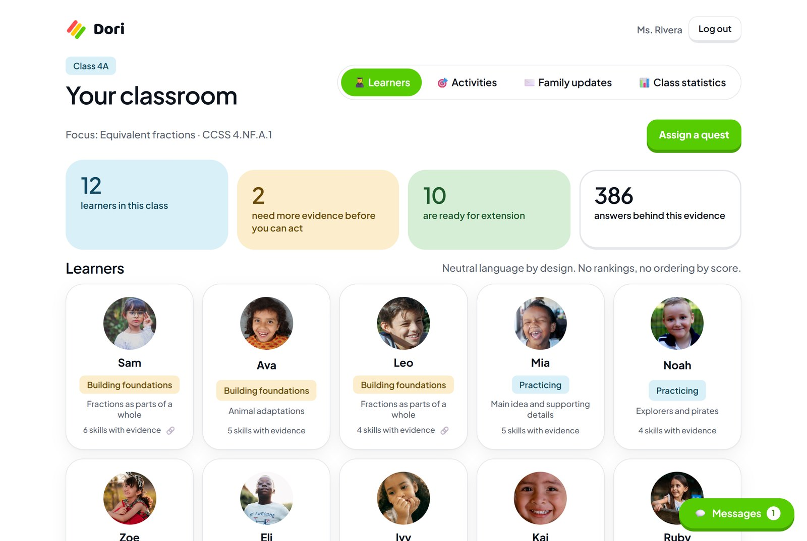
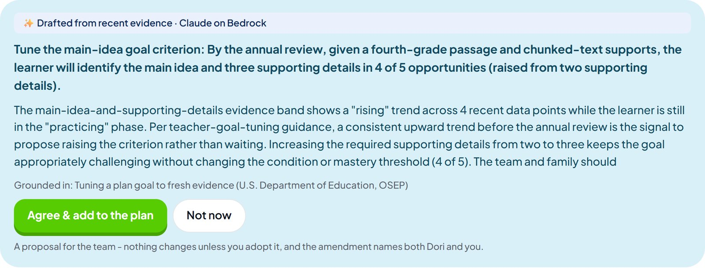
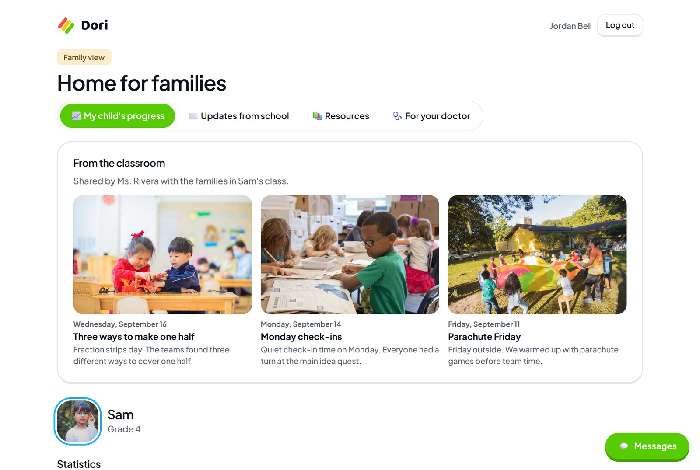

<div align="center">

# Dori

**Learning that listens to every kid.**

An accessible K-12 practice platform for students with IEPs and 504 plans — adaptive
check-ins for the learner, evidence for the teacher, plain language for the family.

[**Live demo**](https://d1fai7rdy6j53g.cloudfront.net) ·
[PRD](docs/PRD.md) · [Tech stack](docs/TECH_STACK.md) · [Learner model](docs/LEARNER_MODEL.md) ·
[Privacy](docs/PRIVACY_POSTURE.md) · [Guidelines](docs/GUIDELINES.md) · [AWS](docs/AWS.md)



</div>

---

## The idea

About 15% of U.S. public school students receive special education services under IDEA, and
more have 504 plans. That plan is written once a year by a team — teacher, family,
specialists — and then everyone goes back to their own corner. The
child practices without the plan in sight, the family hears "fine, thanks" at pickup, and the
evidence that should tune the plan sits in a gradebook nobody reads together.

Dori puts the three of them around one shared plan:

| | |
|---|---|
| **The learner** | practices on a path that adapts, reads itself aloud, zooms, and never shows a rank |
| **The teacher** | sees item-level evidence, drafts activities and plan updates, keeps every decision |
| **The family** | reads progress in plain language, suggests goals, and is in the loop by default |

---

## What it looks like

### The learner's path

Growth, not a leaderboard. Each subject opens with a short check-in, then unlocks a winding
path whose questions adapt to that child — but whose steps always start at zero, so every
learner grows from the same line. No score is ever shown to a child.



### A quiz built for access

One play button reads the question aloud and highlights each word as it goes. Contrast and
text size live in the top bar. Passages are chunked, hints come from Capy, and a right answer
gets confetti and a small fanfare.



### Learning together, live

Eight collaborative games run over one WebSocket room: one board, everyone's cursor, no
score. Globe Trotters below needs the whole group to agree on the same continent before the
round resolves — disagreement is the point.



### The teacher's evidence

Faces, not a spreadsheet. Every band traces back to answers you can see, and the AI drafts
never leave the teacher's hands without a click.



### AI that proposes, people who decide

Claude reads the plan's supports and the learner's evidence — pseudonymously — and proposes
one concrete change, grounded in district policy and federal guidance, with its sources
named. Nothing moves until a human agrees, and the amendment credits both.



### The family's view

The classroom feed, outcomes in plain language, goals set together, and the child's plan with
a "suggest an update" box that routes to the teacher — never straight into the document.



---

## How the AI works

Three different technologies, each where it belongs:

**1. The learner model is not an LLM.** Item-aware Bayesian knowledge tracing (KT-IDEM) in
NumPy, with next-question selection by maximum Fisher information and explicit routing rules.
Deterministic and inspectable, because a claim about a child's learning has to be defensible.
See [docs/LEARNER_MODEL.md](docs/LEARNER_MODEL.md).

**2. Retrieval-augmented generation for anything written.** Two pipelines — at-home activities
and plan updates — retrieve from an approved corpus (`corpus/manifest.json`: standards,
misconception guidance, district accommodation policy, teacher guidance, reviewed templates,
each carrying tier, citation, reviewer and approval date). Claude answers on Amazon Bedrock
through the Converse API with **forced tool use**, so the reply is a typed object rather than
prose to parse. Every citation is verified against the sources actually supplied; invented
ones are stripped and the draft is flagged.

**3. A tool-use agent for grouping.** For collaborative activities the model chooses whom to
look up and when to stop, then explains the grouping to the teacher, who edits it freely
before publishing.

Nothing reaches a child or a family without a person approving it.

## Security

- **No identity reaches a model.** Requests carry evidence bands and plan supports — never a
  name, id, grade, photo or eligibility label. Names quoted inside plan text are redacted first.
- **Three Bedrock Guardrails, scoped by audience.** Family, teacher and plan-drafting surfaces
  each get their own; all deny diagnosis and medication, and each denies what *that* surface
  must never do. Enforced on input and output, so a prompt injection hiding in a corpus
  document is filtered too.
- **Authorization in the data layer, on every request.** Signed tokens carry the role and user
  id; a parent reaches only their own child, a student never reaches analytics, and a targeted
  family update returns 404 to everyone else.
- **No long-lived keys.** The instance assumes an IAM role for Bedrock, DynamoDB and S3.
- **Private by default.** S3 public access blocked with AES-256 at rest, photo bytes served
  only through an authorized route, PBKDF2 for real passwords, and an audit line on every
  consequential action.

Who sees what, and what a district would need before this ships, is in
[docs/PRIVACY_POSTURE.md](docs/PRIVACY_POSTURE.md).

## Architecture

```
Browser (React + Vite + TS)
      │  signed token on every call
      ▼
FastAPI on EC2 ──────────────► Amazon Bedrock  (Claude Sonnet 4.6 + Guardrails)
      │                          RAG over corpus/manifest.json
      ├──────────────────────► DynamoDB   (all state, single table)
      ├──────────────────────► S3         (classroom photos, private)
      └── in process ────────► KT-IDEM learner model (NumPy)

CloudFront terminates TLS in front of the instance, which is what lets an HTTPS page
open the game WebSockets.
```

```
apps/web            React + Vite + TypeScript — student, teacher and family routes
  src/games         Shared room client: one socket, one snapshot, one send()
  src/pages/games   One screen per collaborative activity
services/api        FastAPI — the only thing that touches data, models or AWS
  app/mastery       KT-IDEM tracing and adaptive item selection
  app/ai            RAG pipelines: retrieval, schemas, generation, grouping, plan updates
  app/games         Activity registry, one module per game (state + apply)
  app/routers       One router per surface, authorization enforced in each
corpus              The approved source manifest every generated word is grounded in
data/seed           Synthetic skills, items, learners, plans, links and photos
docs                PRD, tech stack, learner model, privacy posture, guidelines
scripts             AWS provisioning and deployment, item build, screenshot capture
```

## Run it locally

Requires Node 20+ and Python 3.12+. No AWS account needed — without credentials the
generative features fall back to cached and rule-based drafts, and everything else is
identical.

```bash
# API — first run creates the venv
cd services/api
python -m venv .venv
.venv/bin/python -m pip install -r requirements.txt      # Windows: .venv/Scripts/python
.venv/bin/python -m uvicorn app.main:app --port 8010 --reload
```

```bash
# Web — second terminal
cd apps/web
npm install
npm run dev
```

Open <http://localhost:5173>. The API runs on 8010; Vite proxies `/api` to it.

### Demo accounts

Synthetic data throughout. Seeded logins stay plaintext so judges can read them off the
screen; anything a real person types at sign-up is salted and hashed with PBKDF2, and Cognito
is the production plan.

| Role | Username | Password |
|---|---|---|
| Student — Sam (IEP, reading) | `sam` | `otter123` |
| Student — Mia (504, ADHD) | `mia` | `otter123` |
| Student — Ava | `ava` | `otter123` |
| Teacher — Ms. Rivera | `rivera` | `teach123` |
| Family — Jordan Bell (Sam's guardian) | `jordan` | `family123` |

The three learners share a **Demo Table** group in every game, so two or three people can sign
in on separate devices, open the same activity, and land in the same room.

### Useful commands

```bash
cd services/api && .venv/bin/python -m pytest      # 157 tests
curl -X POST localhost:8010/demo/reset             # restore seeded state
python scripts/build_items.py                      # rebuild the item bank
python scripts/check_aws.py                        # pre-flight: creds, models, a live Converse call
python scripts/capture_screens.py                  # regenerate the screenshots above
```

### Going live on AWS

```bash
python scripts/provision_aws.py          # S3 bucket, DynamoDB table, IAM role
python scripts/provision_guardrail.py    # the three Bedrock guardrails
python scripts/deploy_ec2.py             # launch the instance (pulls main, self-updates)
python scripts/deploy_cloudfront.py      # TLS in front of it
```

Details, including which Claude models a Workshop Studio account actually exposes, are in
[docs/AWS.md](docs/AWS.md).

## Collaborative activities

| Activity | What the group does | Grouped by |
|---|---|---|
| Beat Together | Build one 8-count loop together | equivalent-fractions evidence |
| Fraction Strips Together | Shade a wall to find every row equal to the target | equivalent-fractions evidence |
| Story Detectives | Sort clues into big idea, helpful detail, not in the story | main-idea evidence |
| Globe Trotters | Agree on the continent or ocean a clue describes | continents evidence |
| Checkers Corner | A friendly game of checkers, two seats | any pair |
| Memory Meadow | Find matching pairs on one shared board | mixed, no evidence used |
| Sort It Out | Invent your own groups, name them, defend them | mixed, no evidence used |
| Shape Shift | Turn and flip pieces to fill a shared outline | mixed, no evidence used |

Games are free play: no score, no timer, and nothing from a room reaches the mastery model,
the teacher dashboard, or a family. Games that work alone can also be opened solo, in a room
private to that learner.

## Accessibility

Built to WCAG 2.2 AA, and designed with the learner in mind rather than retrofitted:
read-aloud with word-level highlighting, per-item rules so a reading passage still measures
reading, high contrast that preserves the mascot, zoom scoped to the learner's own content,
reduced motion honoured everywhere, full keyboard paths, and no numeric score shown to a
child in any view.

---

<div align="center">

Built at the **Minds & Machines: AI in Education Hackathon 2026** · AWS + University of Utah RAI + AI Utah

Synthetic data only. Not a real student record, and not medical, legal or educational advice.

</div>
